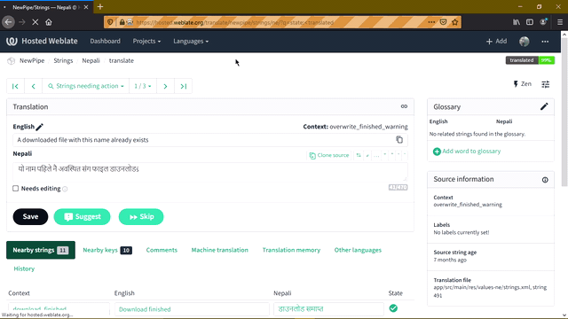

# OSS-translator

This project uses python selenium with the help of the ['googletrans'](https://pypi.org/project/googletrans) python library to translate for various OSS projects available/listed in weblate.org.



It works suprisingly well for majority of strings. For dynamic strings however, you will need to review it and manually edit parts of it.

Eg of dynamic strings.

    "%s has expired"

## Installation:

You will need python 3.4+ and selenium webdriver for firefox in your system path. If you use chrome get [chromedriver](http://chromedriver.chromium.org/downloads/) and add it to your system path.

```
git clone https://github.com/hemanta212/oss-translator.git
cd oss-translator
poetry install # or pip install -r requirements.txt
```

## Usage

Go to hosted.weblate.org and navigate to project translate page. Then copy the url from address bar to your clipboard.

Go to terminal,

```
python translate.py [url] [from] [to] [firefox or chrome]
```

Eg. If I need to contribute to 'Then newpipe project' to translate from english to nepali language in my firefox browser then,
The url will be [this link.](https://hosted.weblate.org/translate/newpipe/strings/ne/?q=state%3A%3Ctranslated&offset=4)

Then,

```
python translate.py "https://hosted.weblate.org/translate/newpipe/strings/ne/?q=state%3A%3Ctranslated&offset=4" english nepali firefox
```
Your browser should open, 

* You will get 40 seconds to sign into the website.
* After 40 seconds the url will be redirected to the one you entered 
* Everything will be then done automatically.

#### *Note*: 
* You may need to activate virtualenv if you use it. Similarly for poetry users, use 'poetry run python' instead of 'python' command.
* Do not forget the apostropes around url.
